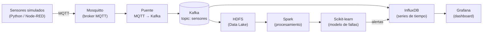

# Grupo 5 – IoT + Big Data: mantenimiento predictivo en una fábrica

Este prototipo simula sensores de máquinas industriales (temperatura, vibración, presión, RPM), envía sus datos a la nube, los guarda en una plataforma de Big Data y usa Machine Learning para **detectar anomalías y anticipar fallas**. Un dashboard muestra todo en tiempo real.

## Arquitectura



| Paso | Componente | Qué hace |
|---|---|---|
| 1 | **Sensores** | Generan lecturas de cada máquina y las publican por MQTT |
| 2 | **Mosquitto (MQTT)** | Recibe los mensajes de los sensores. MQTT es un protocolo liviano pensado para IoT |
| 3 | **Kafka** | Guarda los mensajes en una cola durable para que varios consumidores los procesen |
| 4 | **InfluxDB** | Base de datos de series de tiempo para consultar y graficar en tiempo real |
| 5 | **HDFS** | Data Lake con todo el histórico en crudo |
| 6 | **Spark** | Limpia el histórico y calcula métricas por ventanas de tiempo |
| 7 | **Scikit-learn** | Entrena el modelo que detecta anomalías y predice fallas |
| 8 | **Grafana** | Dashboard para monitorear las máquinas y ver las alertas |

## Estructura del repositorio

```
.
├── docker-compose.yml       # Levanta todos los servicios
├── docs/                    # Informe técnico e imágenes
├── sensores/                # Simulador de sensores IoT          (PR 1)
├── mosquitto/               # Configuración del broker MQTT      (PR 1)
├── puente-mqtt-kafka/       # Pasa los mensajes de MQTT a Kafka  (PR 2)
├── consumidor-influxdb/     # Kafka → InfluxDB                   (PR 3)
├── consumidor-hdfs/         # Kafka → HDFS                       (PR 4)
├── spark/                   # Procesamiento con PySpark          (PR 5)
├── ml/                      # Modelo de predicción de fallas     (PR 6)
└── grafana/                 # Dashboard                          (PR 7)
```

Cada carpeta tiene su propio `README.md` que explica ese componente.

## Requisitos

- [Docker](https://docs.docker.com/get-docker/) con Docker Compose
- ~8 GB de RAM libres para levantar todo el stack (Kafka + Hadoop + Spark)
- [uv](https://docs.astral.sh/uv/getting-started/installation/) (solo para correr los scripts de Python fuera de Docker; `uv` también instala Python si hace falta)

## Cómo ejecutarlo

```bash
docker compose up -d --build   # levanta los servicios
docker compose ps              # muestra su estado
docker compose down            # los detiene
```

Para ver los mensajes de los sensores llegando al broker MQTT:

```bash
docker compose exec mosquitto mosquitto_sub -t 'fabrica/#' -v
```

Y llegando a Kafka:

```bash
docker compose exec kafka /opt/kafka/bin/kafka-console-consumer.sh \
  --bootstrap-server kafka:9092 --topic sensores
```

### Servicios disponibles

| Servicio | Puerto | Para qué |
|---|---|---|
| `mosquitto` | 1883 | Broker MQTT |
| `sensores` | – | Simulador de 5 máquinas |
| `kafka` | 9094 | Kafka. Desde Docker se usa `kafka:9092`; desde tu máquina, `localhost:9094` |
| `kafka-init` | – | Crea el topic `sensores` al arrancar y termina |
| `puente-mqtt-kafka` | – | Reenvía las lecturas de MQTT a Kafka |
| `node-red` (opcional) | 1880 | Simulador visual. Se levanta con `docker compose --profile nodered up -d` |

Cada PR va agregando sus servicios a esta tabla.

## Plan de trabajo

El avance se lleva en el issue #1. Cada componente se entrega en un PR aparte:

- [x] PR 0 – Base del proyecto
- [x] PR 1 – Simulación de sensores + broker MQTT
- [x] PR 2 – Transferencia a Kafka
- [ ] PR 3 – Almacenamiento en InfluxDB
- [ ] PR 4 – Data Lake en HDFS
- [ ] PR 5 – Procesamiento con Spark
- [ ] PR 6 – Modelo predictivo con Scikit-learn
- [ ] PR 7 – Dashboard en Grafana
- [ ] PR 8 – Informe técnico y documentación final
