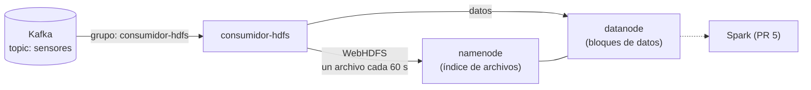

# Consumidor Kafka → HDFS (Data Lake)

`consumidor.py` lee el topic `sensores` de Kafka y guarda **todo el histórico en crudo** en **HDFS**, el sistema de archivos distribuido de Hadoop. Es el **Data Lake** del proyecto, de donde Spark (PR 5) leerá para procesar y entrenar el modelo.



## ¿Por qué un Data Lake si ya tenemos InfluxDB?

| | InfluxDB | Data Lake (HDFS) |
|---|---|---|
| Para qué | Ver el **presente**: dashboard en tiempo real | Analizar el **pasado**: entrenar modelos, reportes |
| Cuánto guarda | 30 días | Todo, sin límite (se agregan más datanodes) |
| Formato | Series de tiempo ya estructuradas | Archivos **crudos**, tal como llegaron |
| Quién lo lee | Grafana | Spark, procesamiento masivo |

Guardar los datos crudos permite **reprocesarlos** más adelante con otra lógica (otro modelo, otra limpieza) sin depender de lo que se decidió hoy.

## HDFS en dos frases

- **namenode**: sabe qué archivos existen y en qué bloques están. Es el "índice".
- **datanode**: guarda los bloques de datos. En producción hay muchos, y cada bloque se copia en 3 de ellos. Aquí hay uno solo (`dfs.replication=1`).

## Cómo se organizan los datos

```
/datalake/crudo/sensores/
├── fecha=2026-10-01/
│   ├── sensores-013251-fd67c3cd.jsonl
│   ├── sensores-013302-603fd5eb.jsonl
│   └── ...
└── fecha=2026-10-02/
    └── ...
```

- **Una carpeta por día** (`fecha=AAAA-MM-DD`). Spark entiende este formato y puede leer solo los días que necesita. A esto se le llama *particionado*.
- **JSON Lines**: una lectura por línea, tal como llegó, más dos campos de Kafka:

```json
{"maquina_id": "maquina-01", "timestamp": "2026-10-01T01:32:41.931Z", "temperatura": 60.33, "vibracion": 2.195, "presion": 4.482, "rpm": 1549.1, "estado": "normal", "_kafka_particion": 2, "_kafka_offset": 0}
```

- **Un archivo cada 60 segundos** (o cada 5000 lecturas, lo que pase primero). Escribir una lectura por archivo crearía millones de archivos chiquitos, y eso es lento para HDFS. Este problema se conoce como *small files problem*.

## Cómo se cuidan los datos

1. Junta lecturas en memoria durante 60 s.
2. Las escribe en HDFS con un **nombre oculto** (`.sensores-….jsonl.tmp`) y al terminar lo **renombra**. Spark ignora los archivos que empiezan con `.`, así que nunca lee un archivo a medio escribir.
3. **Recién entonces** confirma a Kafka que las procesó.

- **Si HDFS no responde** (por ejemplo, en *safe mode* después de reiniciar), reintenta cada 5 s sin confirmar. Cuando vuelve, guarda todo lo acumulado.
- **Al detenerse** (`Ctrl+C` o `docker compose stop`), guarda lo pendiente antes de salir.
- **Mensaje que no es un objeto JSON**: se descarta y queda en el log. Los objetos JSON se guardan **tal cual**, aunque traigan valores raros. Validarlos es tarea de Spark: esa es la idea de una zona *cruda*.
- **Duplicados**: si el consumidor se cae entre el paso 2 y el 3, al volver reescribe ese lote. El par **(`_kafka_particion`, `_kafka_offset`) identifica cada lectura de forma única**, así que Spark puede eliminar duplicados. Esta garantía se llama *at-least-once*: ninguna lectura se pierde, pero alguna puede repetirse.

## Configuración

| Variable | Por defecto | Qué hace |
|---|---|---|
| `KAFKA_BOOTSTRAP` | `localhost:9094` | Dirección de Kafka |
| `KAFKA_TOPIC` / `KAFKA_GRUPO` | `sensores` / `consumidor-hdfs` | Topic y grupo de consumidores |
| `HDFS_URL` | `http://localhost:9870` | WebHDFS del namenode |
| `HDFS_USUARIO` | `hadoop` | Usuario con el que se escribe |
| `HDFS_RUTA` | `/datalake/crudo/sensores` | Carpeta base del Data Lake |
| `SEGUNDOS_POR_ARCHIVO` | `60` | Cada cuánto se escribe un archivo |
| `LECTURAS_POR_ARCHIVO` | `5000` | Máximo de lecturas por archivo |

La configuración de Hadoop está en `docker-compose.yml` (bloque `x-hadoop-config`).

## Cómo probarlo

```bash
docker compose up -d --build
docker compose logs -f consumidor-hdfs     # "Guardado ... (300 lecturas)" cada minuto
```

### Web de HDFS

http://localhost:9870 → menú **Utilities → Browse the file system** → `/datalake/crudo/sensores`.

Ahí se ve cada archivo con su tamaño, y se puede descargar.

### Desde la terminal

```bash
# Listar los archivos
docker compose exec namenode hdfs dfs -ls -R /datalake

# Ver las primeras lecturas
docker compose exec namenode bash -c 'hdfs dfs -cat /datalake/crudo/sensores/fecha=*/*.jsonl 2>/dev/null | head -5'

# Cuántas lecturas hay en total
docker compose exec namenode bash -c 'hdfs dfs -cat /datalake/crudo/sensores/fecha=*/*.jsonl | wc -l'

# Espacio usado
docker compose exec namenode hdfs dfs -du -h /datalake

# Estado del clúster (datanodes vivos, capacidad)
docker compose exec namenode hdfs dfsadmin -report
```

### Correrlo local con uv

WebHDFS funciona en dos pasos: el namenode responde *"escribí en `datanode:9864`"* y el cliente se conecta ahí. Desde tu máquina, el nombre `datanode` no existe, así que hay que agregarlo **una sola vez** al archivo de hosts:

```bash
# macOS / Linux (en Windows: C:\Windows\System32\drivers\etc\hosts)
echo "127.0.0.1 datanode" | sudo tee -a /etc/hosts
```

Luego:

```bash
docker compose up -d mosquitto kafka kafka-init sensores puente-mqtt-kafka namenode datanode
cd consumidor-hdfs
SEGUNDOS_POR_ARCHIVO=10 uv run consumidor.py
```

Los datos de HDFS se guardan en los volúmenes `namenode-data` y `datanode-data`, así que sobreviven a `docker compose down`. Para borrarlos: `docker compose down -v`.
