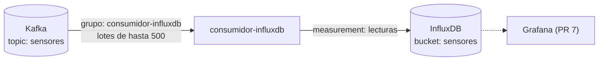

# Consumidor Kafka → InfluxDB

`consumidor.py` lee las lecturas del topic `sensores` de Kafka y las guarda en **InfluxDB**, una base de datos de **series de tiempo**. Desde ahí las consulta Grafana (PR 7) para el dashboard en tiempo real.



## ¿Por qué una base de datos de series de tiempo?

Cada lectura es un **valor medido en un instante**. InfluxDB está hecho para eso:

- Escribe miles de puntos por segundo sin problema.
- Tiene funciones de tiempo listas para usar: promedio por minuto, último valor, diferencia entre lecturas, etc.
- Borra solo los datos viejos (**retención**). Nosotros guardamos **30 días**; el histórico completo va al Data Lake (PR 4).

## Cómo se guardan los datos

| Concepto de InfluxDB | Valor | Qué es |
|---|---|---|
| Organización | `grupo5` | Espacio de trabajo |
| Bucket | `sensores` | La "base de datos", con retención de 30 días |
| Measurement | `lecturas` | La "tabla" |
| Tag | `maquina_id` | Dato indexado para filtrar rápido por máquina |
| Fields | `temperatura`, `vibracion`, `presion`, `rpm`, `estado` | Los valores medidos |
| Time | `timestamp` de la lectura | Momento de la medición en el sensor, no el de llegada |

## Cómo garantiza que no se pierdan ni se dupliquen datos

1. Lee de Kafka un lote de hasta 500 lecturas.
2. Las escribe en InfluxDB.
3. **Recién entonces** le confirma a Kafka que el lote está procesado (*commit*).

- **Si InfluxDB está caído**, el consumidor reintenta cada 5 s sin confirmar nada. Cuando vuelve, sigue desde donde quedó. Solo se reintenta ante fallos de **red o del servidor**: un error en los datos no se arregla reintentando, por eso esos mensajes se descartan antes.
- **Si el consumidor se cae** entre el paso 2 y el 3, al volver relee ese lote. No se duplica: en InfluxDB un punto con la misma máquina y el mismo timestamp **se sobrescribe**.
- **Si llega un mensaje inválido** (JSON roto, campo faltante, valor no numérico, fecha inválida o texto con caracteres inválidos como `"\ud800"`), se descarta y queda en el log. El resto del lote se guarda normal: un mensaje malo no frena al consumidor.
- **Si InfluxDB rechaza datos** (HTTP 400/422, por ejemplo un campo con otro tipo), guarda los puntos válidos del lote, informa en el log cuáles descartó y sigue.

Gracias al grupo de consumidores de Kafka (`consumidor-influxdb`), este consumidor lleva su propia posición en el topic y no interfiere con el del Data Lake (PR 4).

## Configuración

| Variable | Por defecto | Qué hace |
|---|---|---|
| `KAFKA_BOOTSTRAP` | `localhost:9094` | Dirección de Kafka |
| `KAFKA_TOPIC` | `sensores` | Topic a leer |
| `KAFKA_GRUPO` | `consumidor-influxdb` | Grupo de consumidores |
| `INFLUX_URL` | `http://localhost:8086` | Dirección de InfluxDB |
| `INFLUX_TOKEN` | `token-demo-grupo5` | Token de acceso |
| `INFLUX_ORG` / `INFLUX_BUCKET` | `grupo5` / `sensores` | Dónde escribir |

> Las credenciales (`admin` / `admin12345` y el token) son de **demo** y están en `docker-compose.yml`. En producción irían en un archivo `.env` fuera del repositorio.

## Cómo probarlo

```bash
docker compose up -d --build
docker compose logs -f consumidor-influxdb
```

### Interfaz web de InfluxDB

Abrir http://localhost:8086 e ingresar con usuario `admin` y contraseña `admin12345`. En **Data Explorer**:

1. Bucket `sensores`.
2. Measurement `lecturas`.
3. Field `temperatura`.
4. Elegir las máquinas y presionar **Submit**.

### Consultas desde la terminal (lenguaje Flux)

```bash
# Alias para no repetir credenciales
alias influxq='docker compose exec -T influxdb influx query --org grupo5 --token token-demo-grupo5'

# Cuántas lecturas hay por máquina en la última hora
influxq 'from(bucket:"sensores") |> range(start:-1h)
  |> filter(fn:(r) => r._field == "temperatura") |> count()'

# Última lectura de una máquina
influxq 'from(bucket:"sensores") |> range(start:-1h)
  |> filter(fn:(r) => r.maquina_id == "maquina-01") |> last()'

# Temperatura promedio por minuto
influxq 'from(bucket:"sensores") |> range(start:-1h)
  |> filter(fn:(r) => r._field == "temperatura")
  |> aggregateWindow(every: 1m, fn: mean)'
```

### Correrlo local con uv

```bash
docker compose up -d mosquitto kafka kafka-init sensores puente-mqtt-kafka influxdb
cd consumidor-influxdb
uv run consumidor.py
```

### Reprocesar todo desde el inicio

Útil si se borró el bucket. Con el consumidor detenido:

```bash
docker compose stop consumidor-influxdb
docker compose exec kafka /opt/kafka/bin/kafka-consumer-groups.sh \
  --bootstrap-server kafka:9092 --group consumidor-influxdb \
  --reset-offsets --to-earliest --topic sensores --execute
docker compose start consumidor-influxdb
```
