# Informe técnico: IoT + Big Data para mantenimiento predictivo

| | |
|---|---|
| **Proyecto** | Sistema de captura, almacenamiento y análisis predictivo de sensores IoT en una fábrica |
| **Grupo** | 5 |
| **Integrantes** | {COMPLETAR: nombre y matrícula de cada integrante} |
| **Asignatura / docente** | {COMPLETAR} |
| **Fecha** | {COMPLETAR} |
| **Repositorio** | https://github.com/felixmpa/grupo-5-big-data |

---

## Índice

1. [Resumen](#1-resumen)
2. [Introducción y problema](#2-introducción-y-problema)
3. [Objetivos](#3-objetivos)
4. [Arquitectura](#4-arquitectura)
5. [Implementación por capas](#5-implementación-por-capas)
    - 5.1 [Sensores IoT y MQTT](#51-sensores-iot-y-mqtt)
    - 5.2 [Transferencia con Kafka](#52-transferencia-con-kafka)
    - 5.3 [Almacenamiento en tiempo real: InfluxDB](#53-almacenamiento-en-tiempo-real-influxdb)
    - 5.4 [Data Lake: Hadoop HDFS](#54-data-lake-hadoop-hdfs)
    - 5.5 [Procesamiento con Spark](#55-procesamiento-con-spark)
    - 5.6 [Modelo predictivo con Scikit-learn](#56-modelo-predictivo-con-scikit-learn)
    - 5.7 [Visualización con Grafana](#57-visualización-con-grafana)
6. [Resultados del modelo](#6-resultados-del-modelo)
7. [Pruebas de resiliencia y calidad de datos](#7-pruebas-de-resiliencia-y-calidad-de-datos)
8. [Eficiencia y escalabilidad hacia la nube](#8-eficiencia-y-escalabilidad-hacia-la-nube)
9. [Limitaciones y trabajo futuro](#9-limitaciones-y-trabajo-futuro)
10. [Conclusiones](#10-conclusiones)
11. [Guía para ejecutar la demo](#11-guía-para-ejecutar-la-demo)
12. [Referencias](#12-referencias)
- [Anexo A: Historial de desarrollo](#anexo-a-historial-de-desarrollo)
- [Anexo B: Capturas pendientes del equipo](#anexo-b-capturas-pendientes-del-equipo)

---

## 1. Resumen

Diseñamos y construimos un **prototipo funcional de mantenimiento predictivo** para una fábrica. Cinco máquinas simuladas envían cada segundo lecturas de temperatura, vibración, presión y RPM, que recorren un pipeline de Big Data completo:

- **MQTT** recibe las lecturas de los sensores.
- **Kafka** las distribuye al resto del sistema.
- **InfluxDB** las guarda para el monitoreo en tiempo real.
- **HDFS** guarda todo el histórico (*Data Lake*).
- **Spark** limpia los datos y calcula características.
- **Scikit-learn** entrena modelos que **predicen fallas antes de que ocurran**.
- **Grafana** muestra todo en un dashboard con alertas.

Resultados principales:

- **El modelo avisó las 25 fallas del conjunto de prueba antes de que empezaran, con ~1 minuto de anticipación (56 s en promedio)**, y una exactitud de clasificación del **98.4 %**.
- En vivo, el estado predicho coincidió con el real en el **99.3 %** de los casos, con falsas alarmas en solo el **0.5 %** de los momentos normales.
- El pipeline **no pierde ni duplica datos** ante caídas de Kafka, InfluxDB o HDFS. Lo verificamos comparando mensaje a mensaje.
- Guardar el histórico en **Parquet ocupa ~19 veces menos** que el JSON crudo.

Todo el sistema (12 servicios) se levanta con un solo comando de Docker Compose.

## 2. Introducción y problema

En una fábrica, una máquina que falla sin aviso detiene la producción, daña otras piezas y obliga a reparaciones urgentes y caras. Hay tres formas de encarar el mantenimiento:

| Estrategia | Cuándo se interviene | Problema |
|---|---|---|
| **Correctivo** | Después de la falla | Paradas no planificadas, daños mayores |
| **Preventivo** | Cada cierto tiempo, aunque la máquina esté bien | Se cambian piezas que todavía servían |
| **Predictivo** | Cuando los datos indican que la falla se acerca | Requiere sensores, datos y modelos |

El **mantenimiento predictivo** combina dos tecnologías:

- **IoT (Internet de las Cosas):** sensores en cada máquina que miden continuamente su estado y lo envían por red.
- **Big Data:** una plataforma capaz de recibir, guardar y analizar ese flujo constante de datos, de muchas máquinas, durante meses o años.

El desafío técnico es que los datos llegan **sin parar** (una lectura por segundo por máquina), deben verse **en tiempo real** y a la vez acumularse para **aprender del pasado**. Ninguna herramienta resuelve todo sola. Por eso la solución es una arquitectura de varias piezas especializadas.

## 3. Objetivos

**General:** diseñar un sistema que capture datos de sensores IoT en una fábrica, los transmita eficientemente, los almacene en una plataforma escalable de Big Data y aplique análisis predictivo para anticipar fallas.

**Específicos:**

1. Simular sensores IoT (vibración, temperatura, presión, RPM) con Python y Node-RED.
2. Transmitir los datos con un broker **MQTT** y **Kafka**.
3. Almacenarlos en **InfluxDB** (series de tiempo) y **Hadoop HDFS** (Data Lake).
4. Procesarlos con **Spark** y aplicar **Machine Learning** (Scikit-learn) para detectar anomalías y predecir fallas.
5. Visualizarlos en tiempo real con **Grafana**.
6. Verificar que el sistema sea **confiable**: que no pierda ni duplique datos ante fallas.

## 4. Arquitectura

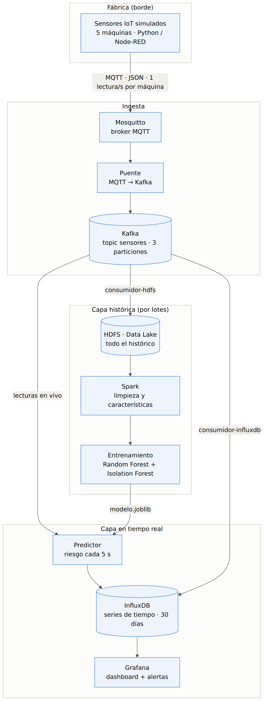

*Figura 1. Arquitectura del sistema. Fuente: `docs/diagramas/arquitectura.mmd`.*

La arquitectura sigue la idea de la **arquitectura Lambda**, que separa dos caminos para los mismos datos:

- **Capa en tiempo real:** responde *"¿qué está pasando ahora?"*. Las lecturas van a InfluxDB y el predictor calcula el riesgo cada 5 segundos. Grafana lo muestra con segundos de retraso.
- **Capa histórica (por lotes):** responde *"¿qué aprendimos del pasado?"*. Todo se guarda en HDFS; Spark lo procesa y con eso se entrena el modelo. Es más lenta, pero trabaja con todo el histórico.

**Kafka es el centro**: recibe cada lectura una sola vez y cada consumidor la lee de forma independiente, a su ritmo y sin afectar a los demás.

### Componentes

| Capa | Componente | Tecnología (versión) | Rol |
|---|---|---|---|
| Borde | Sensores | Python 3.12 + paho-mqtt 2.1 / Node-RED 4.0 | Simulan 5 máquinas y publican 1 lectura/s |
| Ingesta | Broker MQTT | Eclipse Mosquitto 2 | Punto de entrada liviano para dispositivos IoT |
| Ingesta | Puente | Python + confluent-kafka 2.15 | Pasa los mensajes de MQTT a Kafka |
| Ingesta | Cola de eventos | Apache Kafka 4.2 (KRaft) | Guarda y distribuye los mensajes (3 particiones, 7 días) |
| Almacenamiento | Series de tiempo | InfluxDB 2.8 | Datos recientes para consultas rápidas (30 días) |
| Almacenamiento | Data Lake | Apache Hadoop HDFS 3.4.2 | Todo el histórico, crudo y procesado |
| Procesamiento | Batch | Apache Spark 4.0.1 (PySpark) | Limpieza, deduplicación y características |
| ML | Modelos | Scikit-learn 1.9 | Random Forest + Isolation Forest |
| ML | Predicción en vivo | Python | Riesgo cada 5 s por máquina |
| Visualización | Dashboard | Grafana 12.4 | Paneles, alertas e historial |

### Recorrido de una lectura

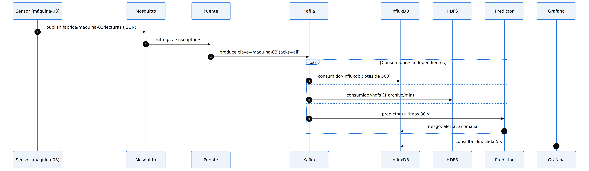

*Figura 2. Recorrido de una lectura desde el sensor hasta Grafana. Los tres consumidores de Kafka trabajan en paralelo y de forma independiente.*

### Decisiones de diseño principales

| Decisión | Alternativa | Por qué la elegimos |
|---|---|---|
| **MQTT y Kafka** (los dos) | Solo uno | MQTT es ideal para dispositivos (liviano, poca batería) pero no guarda mensajes. Kafka guarda y reparte, pero es pesado para un sensor. Cada uno hace lo suyo |
| Clave de Kafka = `maquina_id` | Sin clave | Todas las lecturas de una máquina van a la misma partición, así **Kafka mantiene su orden** |
| InfluxDB **y** HDFS | Solo una base | InfluxDB es rápida para el presente pero no está pensada para años de datos crudos. HDFS guarda todo barato, pero no es para consultas instantáneas |
| HDFS en JSON crudo → Spark → Parquet | Guardar ya procesado | Guardar lo crudo permite **reprocesar** con otra lógica en el futuro |
| Docker Compose | Instalar cada herramienta | Cualquier integrante levanta los 12 servicios con un comando |
| `uv` para Python | pip + requirements | Versiones exactas fijadas (`uv.lock`): lo mismo en local y en Docker |

## 5. Implementación por capas

### 5.1 Sensores IoT y MQTT

**Código:** `sensores/simulador.py`, `sensores/node-red/flujo-sensores.json`, `mosquitto/mosquitto.conf`

No contamos con máquinas reales, así que **simulamos 5 máquinas**. Cada una tiene valores base un poco distintos y pasa por tres estados:

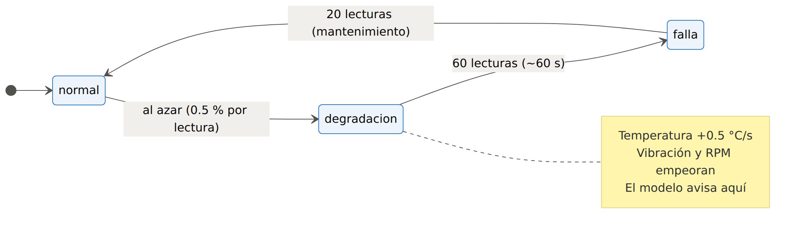

*Figura 3. Ciclo de estados de cada máquina simulada.*

| Sensor | Normal | En falla |
|---|---|---|
| Temperatura | 55–65 °C | +30 °C |
| Vibración | 1.5–2.5 mm/s | ~8 mm/s |
| Presión | 4.5–5.5 bar | −1.5 bar |
| RPM | 1450–1550 | −200 |

La **degradación** es la etapa clave: durante ~60 segundos los valores empeoran poco a poco. **Si el modelo la detecta, avisa antes de la falla.**

Cada lectura se publica en el topic MQTT `fabrica/<maquina_id>/lecturas` como JSON (163 bytes):

```
fabrica/maquina-01/lecturas {"maquina_id": "maquina-01", "timestamp": "2026-10-01T05:36:27.269Z", "temperatura": 56.48, "vibracion": 2.427, "presion": 5.063, "rpm": 1456.7, "estado": "normal"}
fabrica/maquina-02/lecturas {"maquina_id": "maquina-02", "timestamp": "2026-10-01T05:36:27.269Z", "temperatura": 87.69, "vibracion": 7.862, "presion": 3.711, "rpm": 1300.2, "estado": "falla"}
fabrica/maquina-03/lecturas {"maquina_id": "maquina-03", "timestamp": "2026-10-01T05:36:27.270Z", "temperatura": 61.08, "vibracion": 2.15, "presion": 4.754, "rpm": 1477.5, "estado": "normal"}
```

*Salida real de `mosquitto_sub -t 'fabrica/#' -v`. La `maquina-02` está en falla: temperatura 87.7 °C y vibración 7.9 mm/s.*

> El campo `estado` es la **respuesta correcta** de cada lectura. Un sensor real no lo enviaría. Lo usamos solo para entrenar y evaluar el modelo.

**Node-RED** (opcional) hace lo mismo de forma visual. Un nodo *inject* dispara cada segundo una función que genera la lectura, y un nodo *mqtt out* la publica:

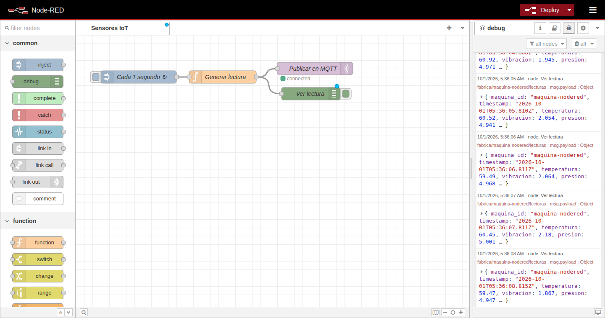

*Figura 4. Flujo de Node-RED publicando la máquina `maquina-nodered`. A la derecha, las lecturas en el panel de depuración.*

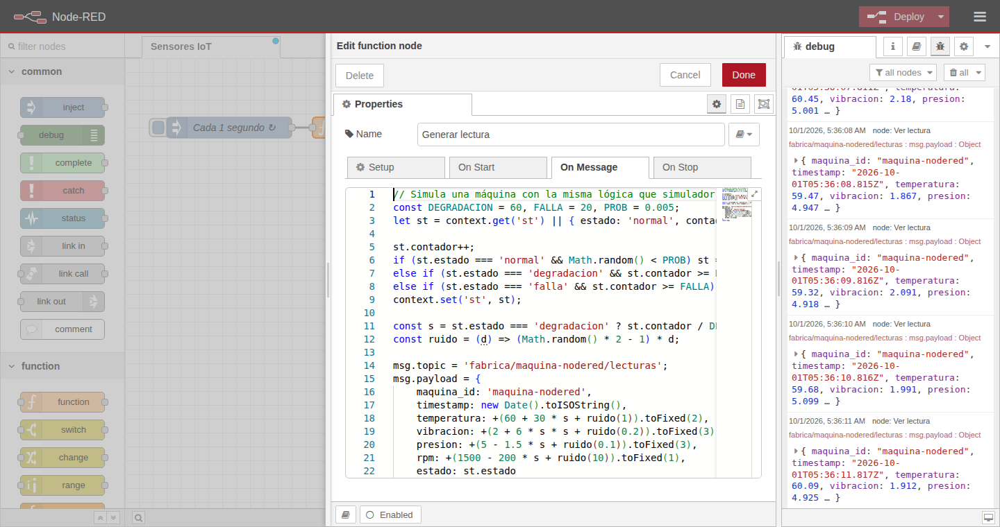

*Figura 5. Código del nodo "Generar lectura": la misma lógica de estados del simulador en Python.*

Además, `sensores/generar_historico.py` genera **horas de historia pasada en segundos**, con timestamps antiguos. Así hay datos para entrenar sin esperar. 2 horas son 36 000 lecturas, publicadas en ~6 s, que recorren el pipeline completo igual que las reales.

### 5.2 Transferencia con Kafka

**Código:** `puente-mqtt-kafka/puente.py`, servicios `kafka` y `kafka-init` en `docker-compose.yml`

El **puente** se suscribe a `fabrica/+/lecturas` y reenvía cada mensaje al topic `sensores` de Kafka. Configuración clave:

| Parámetro | Valor | Efecto |
|---|---|---|
| Clave del mensaje | `maquina_id` | Orden garantizado por máquina |
| `acks` | `all` | Kafka confirma cada mensaje antes de darlo por enviado |
| `enable.idempotence` | `true` | Si reintenta, no genera duplicados |
| `linger.ms` | 50 | Agrupa mensajes en lotes: menos viajes por la red |
| Particiones | 3 | Permite leer en paralelo |
| Retención | 7 días | Si un consumidor se cae, puede ponerse al día |

Kafka corre en modo **KRaft** (sin Zookeeper), en un solo nodo. Salida real del topic:

```
Topic: sensores	PartitionCount: 3	ReplicationFactor: 1	Configs: min.insync.replicas=1,retention.ms=604800000
	Topic: sensores	Partition: 0	Leader: 1	Replicas: 1	Isr: 1
	Topic: sensores	Partition: 1	Leader: 1	Replicas: 1	Isr: 1
	Topic: sensores	Partition: 2	Leader: 1	Replicas: 1	Isr: 1
```

Y de los mensajes, con su partición y su clave:

```
Partition:1	maquina-02	{"maquina_id": "maquina-02", "timestamp": "2026-10-01T05:36:29.273Z", "temperatura": 87.69, ...}
Partition:1	maquina-04	{"maquina_id": "maquina-04", "timestamp": "2026-10-01T05:36:29.273Z", "temperatura": 53.67, ...}
Partition:1	maquina-05	{"maquina_id": "maquina-05", "timestamp": "2026-10-01T05:36:29.273Z", "temperatura": 56.25, ...}
```

Tres grupos de consumidores leen el mismo topic **de forma independiente**: `consumidor-influxdb`, `consumidor-hdfs` y `predictor`. Los dos primeros guardan su posición (*offset*) en Kafka: si se caen, siguen desde donde quedaron. El predictor no la guarda a propósito, porque solo le interesa el presente y al reiniciar empieza desde el último mensaje:

```
GRUPO                  LAG (mensajes pendientes)
consumidor-hdfs        218      <- normal: escribe un archivo por minuto
consumidor-influxdb    0        <- al día
```

### 5.3 Almacenamiento en tiempo real: InfluxDB

**Código:** `consumidor-influxdb/consumidor.py`

InfluxDB es una base de datos de **series de tiempo**: está optimizada para valores medidos en un instante. Modelo de datos:

| Concepto | Valor |
|---|---|
| Bucket (base) | `sensores`, retención de 30 días |
| Measurement (tabla) | `lecturas` y `predicciones` |
| Tag (índice) | `maquina_id` |
| Fields (valores) | `temperatura`, `vibracion`, `presion`, `rpm`, `estado` |

El consumidor lee lotes de hasta 500 mensajes, los escribe y **recién después confirma a Kafka** (*commit*). Si InfluxDB está caído, reintenta sin confirmar. Si el consumidor se reinicia, relee el lote, pero no hay duplicados: en InfluxDB un punto con la misma máquina y el mismo timestamp se sobrescribe.

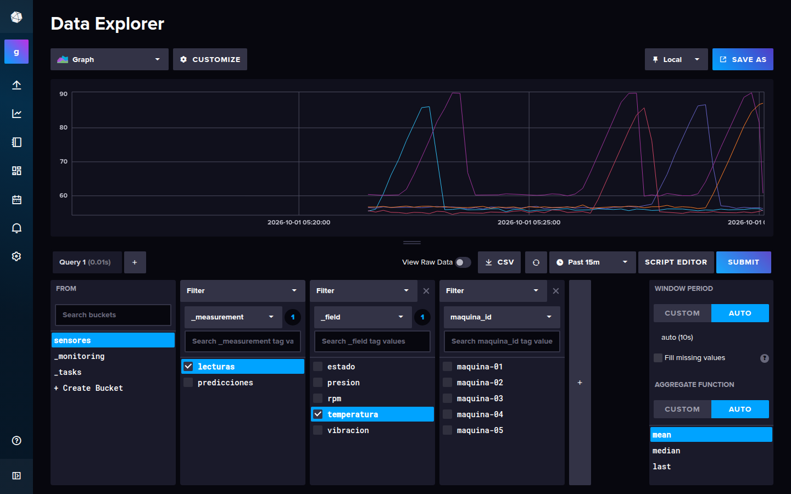

*Figura 6. Data Explorer de InfluxDB: temperatura de las 5 máquinas en los últimos 15 minutos. Los picos son degradaciones seguidas de falla.*

### 5.4 Data Lake: Hadoop HDFS

**Código:** `consumidor-hdfs/consumidor.py`, servicios `namenode` y `datanode`

HDFS es el sistema de archivos distribuido de Hadoop:

- El **namenode** sabe qué archivos existen y dónde están sus bloques.
- Los **datanodes** guardan los bloques. En producción hay muchos y cada bloque se copia en 3; aquí hay uno solo.

El consumidor guarda **todo el histórico en crudo**, organizado por día:

```
/datalake/crudo/sensores/fecha=2026-10-01/sensores-053502-8cd0f89d.jsonl
```

Decisiones importantes:

- **Un archivo por minuto** (o cada 5000 lecturas). Escribir un archivo por lectura crearía millones de archivos chicos, algo muy lento para HDFS (*small files problem*).
- **Escritura atómica:** primero se escribe con un nombre oculto (`.archivo.tmp`) y al terminar se renombra. Spark ignora los archivos ocultos, así que nunca lee uno a medias.
- Cada línea lleva **`_kafka_particion` y `_kafka_offset`**. Ese par identifica cada lectura de forma única y permite eliminar duplicados después.

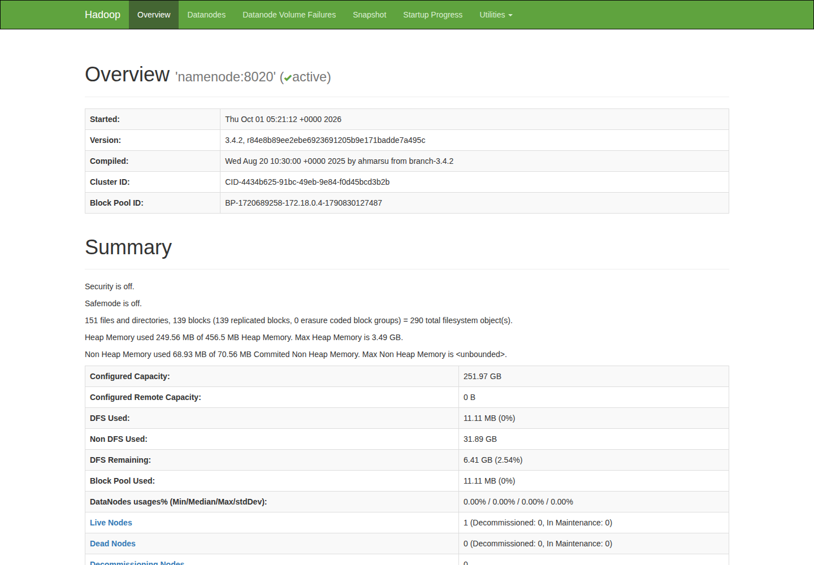

*Figura 7. Web del namenode: clúster activo, safe mode apagado, 1 datanode vivo.*

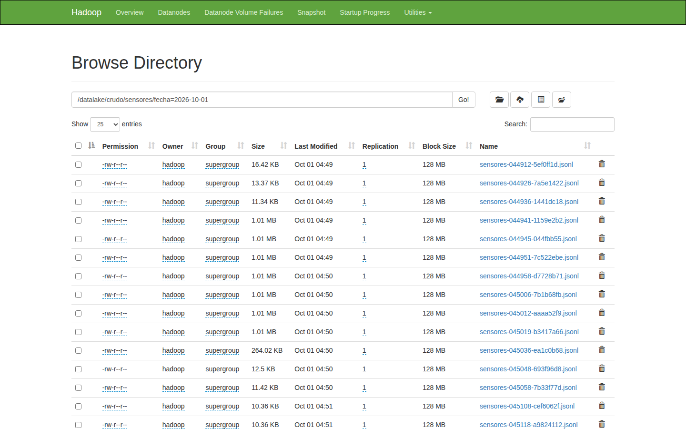

*Figura 8. Archivos de la zona cruda. Los de ~1 MB son lotes de 5000 lecturas de la historia generada. Los de 10–16 KB son lotes de lecturas en vivo cada 10 s, la configuración acelerada que usamos en las pruebas; por defecto se escribe cada 60 s (~64 KB, ~300 lecturas).*

### 5.5 Procesamiento con Spark

**Código:** `spark/procesar.py`

Spark reparte el trabajo en tareas que corren en paralelo. Aquí corre en un contenedor (`local[*]`), pero el mismo código funciona en un clúster de cientos de máquinas cambiando solo el parámetro `--master`.

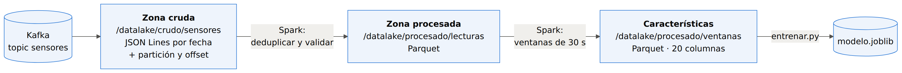

*Figura 9. Zonas del Data Lake: de los datos crudos a las características para el modelo.*

El job hace tres pasos:

1. **Deduplicar** por (`_kafka_particion`, `_kafka_offset`).
2. **Validar** cada lectura: campos presentes, valores numéricos, fecha válida, estado conocido y valores dentro del rango físico (por ejemplo, temperatura entre −40 y 200 °C).
3. **Calcular características por ventana de 30 segundos** y por máquina. Para cada sensor: media, desviación, mínimo, máximo y **tendencia** (pendiente de la recta, cuánto sube o baja por segundo).

Los resultados se guardan en **Parquet**, un formato por columnas y comprimido. Prueba con datos sucios a propósito (todo duplicado + 5 lecturas inválidas):

```
Lecturas en el Data Lake: 2820
  duplicadas eliminadas:  1410
  inválidas descartadas:  5
  lecturas limpias:       1405
Guardado hdfs://namenode:8020/datalake/procesado/lecturas
Guardado hdfs://namenode:8020/datalake/procesado/ventanas (50 ventanas de 30 seconds)

|estado_mayoritario|ventanas|temperatura_media|vibracion_media|presion_media|rpm_media|vibracion_desv|temp_tendencia_por_s|
|normal            |22      |62.03            |2.38           |4.81         |1481.82  |0.395         |-0.104              |
|degradacion       |22      |75.23            |4.4            |4.2          |1376.95  |0.961         |0.402               |
|falla             |6       |83.5             |6.77           |3.83         |1334.11  |1.866         |-0.689              |
```

La tabla muestra que las características **separan bien los estados**. En degradación la temperatura sube ~0.4 °C por segundo, justo la señal temprana que el modelo necesita.

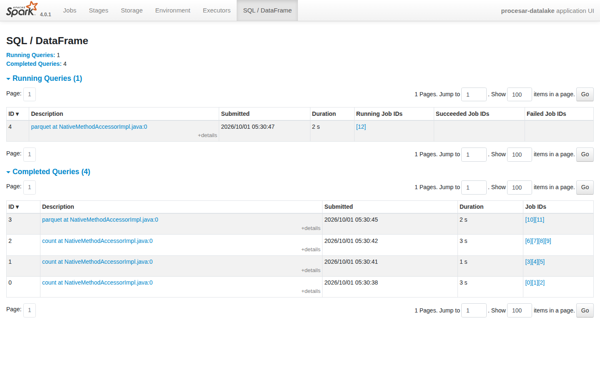

*Figura 10. Web de Spark durante la ejecución del job `procesar-datalake`: consultas de conteo y escritura en Parquet.*

### 5.6 Modelo predictivo con Scikit-learn

**Código:** `ml/entrenar.py`, `ml/predictor.py`, `ml/caracteristicas.py`

Entrenamos **dos modelos con enfoques distintos**:

| | Random Forest (supervisado) | Isolation Forest (no supervisado) |
|---|---|---|
| Aprende de | Ventanas etiquetadas (normal / degradación / falla) | Solo ventanas **normales** |
| Responde | Probabilidad de cada estado. **Riesgo** = P(degradación) + P(falla) | ¿Esta ventana se parece a lo normal? |
| Ventaja | Muy preciso; dice qué está pasando | No necesita fallas etiquetadas, que en una fábrica real son escasas |

Detalles de metodología:

- **División por tiempo:** se entrena con el primer 75 % del período y se evalúa con el último 25 %, como pasaría en la realidad. Mezclar al azar sería hacer trampa, porque las ventanas vecinas son casi iguales.
- **`class_weight="balanced"`:** hay muchas más ventanas normales que de falla, y así el modelo no ignora las fallas.
- **Alerta** cuando el riesgo es ≥ 50 %.

El **predictor en vivo** lee Kafka, guarda los últimos 30 s de cada máquina y cada 5 s calcula **las mismas características que Spark**. Lo verificamos recalculando **las 1230 ventanas** de Spark desde las lecturas limpias: coinciden todos los conteos y la diferencia absoluta máxima es 1e-7, que es ruido de coma flotante. Después aplica los dos modelos y escribe en InfluxDB (`predicciones`). Salida real:

```
maquina-04: ALERTA (riesgo 88%, predicho degradacion, real degradacion)
maquina-05: ALERTA (riesgo 99%, predicho degradacion, real degradacion)
maquina-03: sin alerta (riesgo 3%, predicho normal, real normal)
maquina-04: sin alerta (riesgo 3%, predicho normal, real normal)
maquina-02: ALERTA (riesgo 96%, predicho degradacion, real degradacion)
```

Los resultados están en la [sección 6](#6-resultados-del-modelo).

### 5.7 Visualización con Grafana

**Código:** `grafana/` (todo se configura solo al arrancar)

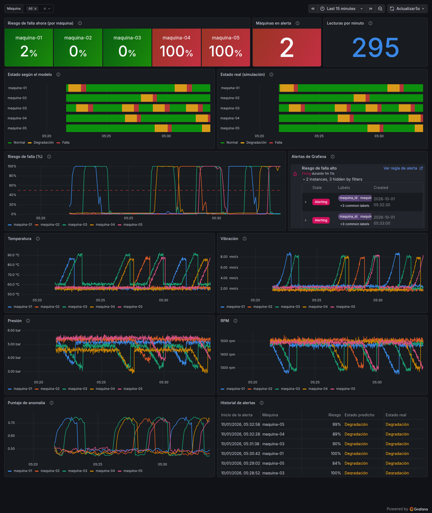

*Figura 11. Dashboard "Fábrica – Mantenimiento predictivo" con datos reales. Dos máquinas en alerta (riesgo 100 %); las líneas de estado del modelo y las reales son casi idénticas.*

| Panel | Qué muestra |
|---|---|
| Riesgo de falla ahora | Último riesgo por máquina (verde < 50 %, rojo ≥ 50 %) |
| Máquinas en alerta / Lecturas por minuto | Estado general y volumen de datos (~300/min) |
| Estado según el modelo / Estado real | Comparación visual: muestra si el modelo acierta |
| Riesgo de falla (%) | Evolución, con el umbral de alerta marcado |
| Alertas de Grafana | Alertas disparadas por la regla |
| Temperatura, Vibración, Presión, RPM | Lecturas, una línea y un color fijo por máquina |
| Puntaje de anomalía | Resultado del Isolation Forest |
| Historial de alertas | Cada entrada en alerta, con su riesgo y los estados predicho y real |

La regla **"Riesgo de falla alto"** se evalúa cada 10 s y se dispara **por máquina**:

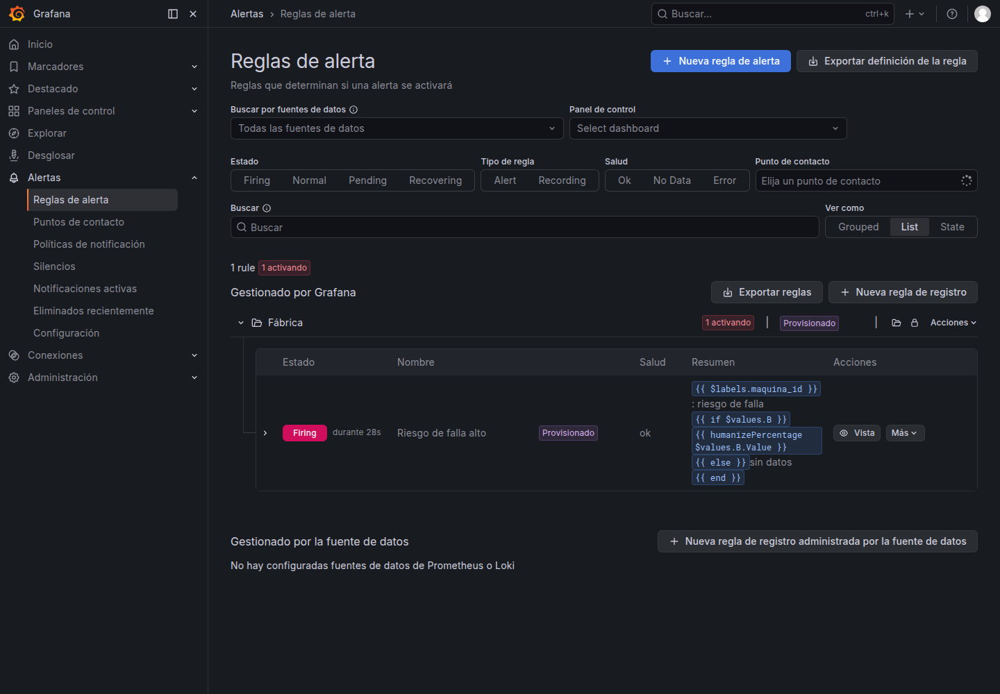

*Figura 12. Regla de alerta disparada (Firing). Para recibir avisos por correo, Telegram o Slack basta con configurar un "contact point".*

## 6. Resultados del modelo

Entrenamos con **2 horas de historia** generadas con semilla 42 desde volúmenes vacíos (1228 ventanas de 30 s: 920 para entrenar y 308 para evaluar). Repitiendo la [guía de la demo](#11-guía-para-ejecutar-la-demo) se obtienen números muy parecidos.

### Clasificador (Random Forest)

| Estado | Precisión | Recall | Ventanas de prueba |
|---|---|---|---|
| Normal | 99.0 % | 98.6 % | 208 |
| Degradación | 98.6 % | 97.3 % | 75 |
| Falla | 92.6 % | 100 % | 25 |
| **Exactitud total** | | **98.4 %** | 308 |

- **Precisión**: cuando el modelo dice "falla", cuántas veces acierta.
- **Recall**: de las fallas reales, cuántas detecta.


*Figura 13. Matriz de confusión. Casi todo está en la diagonal (aciertos). Los pocos errores ocurren entre estados vecinos, en los bordes de una transición.*

### Alertas tempranas

| Métrica | Resultado |
|---|---|
| Ventanas con problema detectadas | **98 %** |
| Falsas alarmas en ventanas normales | **1.9 %** |
| Fallas avisadas **antes de empezar** | **25 de 25** |
| Anticipación | **22 fallas con 60 s y 3 con 30 s** (promedio 56 s) |

La anticipación se mide desde la primera alerta del **tramo de degradación inmediatamente anterior** a cada falla. Como se mide por ventanas, es **múltiplo de 30 s**: "60 s" quiere decir "2 ventanas antes", no una precisión al segundo. Una alerta que llega recién en la ventana de la falla cuenta como 0 s, es decir, no como aviso anticipado.


*Figura 14. Una máquina durante 30 minutos. El riesgo (abajo) sube durante la degradación (amarillo), antes de la falla (rojo).*

### Detector de anomalías (Isolation Forest)

| Estado real | Marcado como anomalía |
|---|---|
| Normal | 3.8 % |
| Degradación | 62.7 % |
| Falla | **100 %** |

Sin haber visto nunca una falla, el detector reconoce **todas**. La degradación temprana le cuesta más, porque al principio se parece mucho a lo normal. Por eso los dos modelos se complementan.

### Qué aprendió el modelo


*Figura 15. Las características más importantes son las **tendencias**: el modelo mira cómo están cambiando los sensores, no solo cuánto valen. Eso le permite avisar antes de que los valores sean extremos.*

### En vivo

Durante 10 minutos de funcionamiento real con el modelo entrenado (610 predicciones):

| Estado real | Alerta activada |
|---|---|
| Degradación | **100 %** (134 de 134) |
| Falla | **100 %** (40 de 40) |
| Normal | 0.5 % (2 de 436, falsas alarmas) |

El estado predicho coincidió con el real en el **99.3 %** de las predicciones.

> **Lección aprendida.** La primera medición en vivo dio solo 64 % de acierto. Antes de dar el modelo por malo, investigamos:
> 1. Las características del predictor coincidían con las de Spark, así que no era un error de cálculo.
> 2. El problema estaba en **cómo comparábamos**. Usábamos el estado de la *última* lectura, pero el modelo mira los últimos 30 s; justo después de una reparación, esos 30 s todavía contienen la falla.
> 3. Además, la simulación estaba acelerada.
>
> Al comparar contra el estado mayoritario de la ventana, que es la misma etiqueta del entrenamiento, el resultado subió a 98.6 %. **Evaluar bien es tan importante como entrenar bien.**

## 7. Pruebas de resiliencia y calidad de datos

Un sistema de Big Data tiene que seguir funcionando cuando algo falla. Probamos cada componente **reiniciándolo con el sistema corriendo** y comparando mensaje a mensaje lo que entró con lo que se guardó.

| Prueba | Resultado |
|---|---|
| Reinicio de **Kafka** | El puente guardó los mensajes en memoria y los envió al volver. 1000 lecturas revisadas: **0 perdidas, 0 duplicadas, 0 fuera de orden** |
| Reinicio de **Mosquitto** | El puente se reconectó solo. Se perdió **1 lectura de 814**, la que iba en camino: MQTT no guarda mensajes, Kafka sí |
| Reinicio de **InfluxDB** | El consumidor reintentó sin confirmar. Kafka 335 = InfluxDB 335; ningún hueco mayor a 1 s |
| Reprocesar InfluxDB desde el inicio | Sigue en 335: **sin duplicados** (los puntos se sobrescriben) |
| **HDFS** en *safe mode* tras reiniciar | Reintentó y al volver guardó las 221 lecturas acumuladas |
| Integridad Kafka → HDFS | 903 mensajes → 901 únicos; los 2 que faltan son exactamente los 2 mensajes inválidos descartados |
| Apagado ordenado (`docker compose stop`) | El puente y los consumidores envían o guardan lo pendiente antes de salir |
| `docker compose down` + `up` | Kafka, InfluxDB y HDFS conservan sus datos (volúmenes) |

### Errores encontrados en la revisión de código

El desarrollo fue por *pull requests* revisados uno a uno. La revisión encontró errores que **ninguna prueba "normal" habría detectado**. Los dos más graves:

1. **Fecha inválida (PR 3).** Un mensaje con `"timestamp": "no-es-una-fecha"` hacía que el consumidor de InfluxDB reintentara para siempre: confundía un error de datos con una caída del servidor. **El pipeline de tiempo real se detenía en silencio.**
2. **Texto con caracteres inválidos (PR 4).** Un texto como `"maq\ud800"` es JSON válido, pero no se puede guardar en UTF-8. Bloqueaba a la vez el consumidor de HDFS y el de InfluxDB.

En los dos casos, la causa de fondo era la misma: **reintentar ante cualquier error**. La corrección tiene dos partes:

- **Validar cada mensaje al leerlo:** si un dato no se puede guardar, se descarta y queda en el log.
- **Reintentar solo ante errores de red o del servidor.**

Desde entonces, todos los componentes siguen esta regla. La revisión del PR 6 encontró que el predictor validaba `maquina_id` pero no `estado`: un `estado` con `"\ud800"` lo hacía caer. Era de baja gravedad, porque el servicio se reinicia solo y salta el mensaje, pero ahora también se valida: 12 mensajes así se descartan sin reiniciar el servicio.

La misma revisión encontró un problema en **cómo medíamos la anticipación**. Si una máquina fallaba dos veces seguidas, sin un periodo normal entre ellas, la alerta de la primera falla se contaba para la segunda y daba avisos de 150 s, imposibles con una degradación de ~60 s. Además, un aviso de 0 s habría contado como "anticipado". Corregimos la métrica, y el promedio pasó de 65 s a un valor honesto de 56 s. **Una métrica mal definida puede hacer ver mejor un modelo sin que nadie lo note.**

Otros hallazgos y correcciones:

- Spark escribía **200 archivos chicos** por tabla (el mismo *small files problem*). Ahora escribe uno por día.
- Spark escribía con **replicación 3** en un clúster de 1 datanode, lo que dejaba bloques *under-replicated*. Corregido a replicación 1.
- Los gráficos de Grafana **unían con una recta** los periodos en que el sistema estuvo apagado. Ahora la línea se corta.

## 8. Eficiencia y escalabilidad hacia la nube

### Volumen de datos

| Medida | Valor |
|---|---|
| Tamaño de una lectura (JSON) | 163 bytes |
| Por máquina por día | 86 400 lecturas ≈ **14 MB** |
| 5 máquinas (este prototipo) | ~300 lecturas/min ≈ 70 MB/día |
| 1000 máquinas | ~86 millones de lecturas/día ≈ **14 GB/día** |
| Histórico en JSON crudo (48 395 lecturas) | 10.3 MB (~213 bytes/lectura con metadatos) |
| El mismo histórico en Parquet | 0.54 MB (**~19 veces menos**) |

### Por qué la transmisión es eficiente

- **MQTT** tiene una cabecera mínima (2 bytes) y mantiene una conexión abierta, en lugar de abrir una por mensaje como HTTP. Es ideal para dispositivos con poca red o batería.
- **QoS 1** en MQTT garantiza que cada lectura llegue al menos una vez al broker.
- **Kafka agrupa mensajes en lotes** (`linger.ms=50`): menos viajes por la red.
- **Parquet** comprime por columnas: el histórico ocupa ~19 veces menos que el JSON.
- Mejoras posibles: compresión en Kafka (`lz4`, `zstd`), formato binario (Protobuf, Avro) en lugar de JSON, o agregar los datos en el borde (por ejemplo, enviar promedios por minuto en lugar de cada lectura).

### Cómo escala cada pieza

| Componente | En el prototipo | En producción |
|---|---|---|
| MQTT | 1 broker, sin autenticación | Clúster (EMQX, HiveMQ) con TLS y usuario por dispositivo |
| Kafka | 1 nodo, 3 particiones | 3 o más brokers, replicación 3, más particiones (una por consumidor en paralelo) |
| InfluxDB | 1 instancia | InfluxDB Cloud / clúster; reducir la resolución de los datos viejos |
| HDFS | 1 namenode + 1 datanode | Namenode con alta disponibilidad, decenas de datanodes, replicación 3 (o almacenamiento de objetos) |
| Spark | `local[*]`, 1 contenedor | Clúster (YARN o Kubernetes); el mismo código, cambiando `--master` |
| Modelo | Reentrenado a mano | Reentrenamiento programado, versionado de modelos (MLflow) |

### Equivalencia en la nube

Cada pieza tiene un servicio administrado equivalente, así que la misma arquitectura se puede llevar a la nube sin rediseñarla:

| Pieza | AWS | Azure | Google Cloud |
|---|---|---|---|
| MQTT | AWS IoT Core | Azure IoT Hub | (MQTT sobre Pub/Sub o terceros) |
| Kafka | Amazon MSK | Event Hubs (API Kafka) | Managed Kafka / Pub/Sub |
| InfluxDB | Timestream for InfluxDB | Azure Data Explorer | Bigtable |
| HDFS (Data Lake) | Amazon S3 | Azure Data Lake Storage | Cloud Storage |
| Spark | EMR / Glue | Databricks / Synapse | Dataproc |
| Scikit-learn | SageMaker | Azure ML | Vertex AI |
| Grafana | Amazon Managed Grafana | Azure Managed Grafana | Grafana Cloud |

## 9. Limitaciones y trabajo futuro

**Limitaciones:**

- **Datos simulados.** Los patrones de falla son más limpios que en una máquina real, así que los resultados del modelo son optimistas. Lo que sí se traslada a la realidad es el **método completo**: datos → características → modelo → alerta en vivo.
- **Etiquetas perfectas.** El campo `estado` solo existe porque es una simulación. En una fábrica las etiquetas salen de los registros de mantenimiento, son pocas y llegan tarde. Por eso incluimos también el detector de anomalías, que no las necesita.
- **Un solo nodo** por componente: no hay alta disponibilidad.
- **Seguridad de demo**: MQTT sin autenticación y credenciales en `docker-compose.yml`. En producción irían en un gestor de secretos, con TLS.
- **Reentrenamiento manual.**

**Trabajo futuro:**

1. **Sensores reales en Raspberry Pi** (por ejemplo, un acelerómetro MPU-6050 para vibración y un DS18B20 para temperatura). Publicarían el mismo JSON por MQTT, así que el resto del sistema no cambia. Ver el [anexo B](#anexo-b-capturas-pendientes-del-equipo).
2. **Spark Structured Streaming** para calcular características directamente desde Kafka.
3. Predecir el **tiempo restante hasta la falla** (*Remaining Useful Life*) con regresión, no solo el estado.
4. **Notificaciones** por Telegram o correo desde Grafana.
5. **Reentrenamiento automático** programado y versionado de modelos con MLflow.

## 10. Conclusiones

1. **IoT y Big Data se complementan.** Los sensores generan el dato, pero sin una plataforma que lo reciba, guarde y analice a escala, ese dato no se convierte en una decisión. Con 5 máquinas ya son 70 MB por día; con 1000, 14 GB.
2. **Cada herramienta resuelve una parte.** MQTT acerca los datos desde los dispositivos, Kafka los desacopla y distribuye, InfluxDB sirve el presente, HDFS guarda el pasado, Spark lo procesa, el ML aprende y Grafana lo comunica. La arquitectura en dos capas (tiempo real e histórica) permite tener las dos cosas a la vez.
3. **El mantenimiento predictivo funciona:** el sistema avisó todas las fallas de la prueba antes de que empezaran, en general con un minuto de anticipación. En una fábrica, ese minuto es la diferencia entre una parada planificada y una avería.
4. **La confiabilidad se diseña y se prueba.** Confirmar después de guardar, deduplicar con offsets, escribir de forma atómica y validar antes de reintentar no son detalles: sin ellos, el sistema pierde o duplica datos, o se detiene en silencio. Varios de estos errores solo aparecieron en la revisión de código, lo que confirma su valor.
5. **La arquitectura es portable.** Cada pieza tiene su equivalente administrado en la nube, así que el prototipo puede crecer sin rediseñarse.

## 11. Guía para ejecutar la demo

Requisitos: Docker con Docker Compose y ~8 GB de RAM libres.

```bash
git clone https://github.com/felixmpa/grupo-5-big-data.git
cd grupo-5-big-data

# 1. Levantar el sistema (12 servicios)
docker compose up -d --build

# 2. Generar 2 horas de historia (36 000 lecturas en segundos); esperar ~1 min a que llegue a HDFS
docker compose run --rm sensores python generar_historico.py --horas 2 --semilla 42

# 3. Procesar el Data Lake con Spark (~20 s)
docker compose run --rm spark

# 4. Entrenar los modelos (crea ml/modelos/modelo.joblib y ml/resultados/)
docker compose run --rm entrenar

# 5. Ver las alertas en vivo
docker compose logs -f predictor
```

| Interfaz | Dirección | Usuario / contraseña |
|---|---|---|
| **Grafana** (dashboard) | http://localhost:3000 | Sin login (lectura); `admin` / `admin12345` para editar |
| InfluxDB | http://localhost:8086 | `admin` / `admin12345` |
| HDFS (namenode) | http://localhost:9870 | — |
| Spark (mientras corre) | http://localhost:4040 | `docker compose run --rm --service-ports spark` |
| Node-RED (opcional) | http://localhost:1880 | `docker compose --profile nodered up -d` |

Para apagar: `docker compose down`. Para borrar también los datos: `docker compose down -v`.

Cada carpeta del repositorio tiene un `README.md` con el detalle de su componente.

## 12. Referencias

- Apache Kafka, documentación: https://kafka.apache.org/documentation/
- Apache Hadoop HDFS, guía de arquitectura: https://hadoop.apache.org/docs/stable/hadoop-project-dist/hadoop-hdfs/HdfsDesign.html
- Apache Spark, guía de Spark SQL y DataFrames: https://spark.apache.org/docs/latest/sql-programming-guide.html
- InfluxDB 2, documentación y lenguaje Flux: https://docs.influxdata.com/influxdb/v2/
- Eclipse Mosquitto: https://mosquitto.org/ · Especificación MQTT 3.1.1 (OASIS): https://docs.oasis-open.org/mqtt/mqtt/v3.1.1/mqtt-v3.1.1.html
- Scikit-learn: *RandomForestClassifier* e *IsolationForest*: https://scikit-learn.org/stable/modules/ensemble.html
- Grafana, provisioning y alertas: https://grafana.com/docs/grafana/latest/administration/provisioning/
- Node-RED: https://nodered.org/docs/
- Marz, N. y Warren, J. (2015). *Big Data: Principles and best practices of scalable realtime data systems*. Manning (arquitectura Lambda).
- Liu, F. T., Ting, K. M. y Zhou, Z.-H. (2008). *Isolation Forest*. IEEE International Conference on Data Mining.

---

## Anexo A: Historial de desarrollo

El proyecto se construyó en *pull requests* pequeños, cada uno revisado y probado antes de integrarlo:

| PR | Contenido |
|---|---|
| [#2](https://github.com/felixmpa/grupo-5-big-data/pull/2) | Base del proyecto: estructura, README, Docker Compose |
| [#3](https://github.com/felixmpa/grupo-5-big-data/pull/3) | Simulador de sensores + Mosquitto + Node-RED |
| [#4](https://github.com/felixmpa/grupo-5-big-data/pull/4) | Kafka + puente MQTT → Kafka |
| [#5](https://github.com/felixmpa/grupo-5-big-data/pull/5) | Consumidor Kafka → InfluxDB (+ corrección de fecha inválida) |
| [#6](https://github.com/felixmpa/grupo-5-big-data/pull/6) | Data Lake en HDFS (+ corrección de texto no codificable) |
| [#7](https://github.com/felixmpa/grupo-5-big-data/pull/7) | Procesamiento con Spark |
| [#8](https://github.com/felixmpa/grupo-5-big-data/pull/8) | Modelos y predicción en vivo |
| [#9](https://github.com/felixmpa/grupo-5-big-data/pull/9) | Dashboard en Grafana |
| #10 | Este informe |

El plan completo está en el issue [#1](https://github.com/felixmpa/grupo-5-big-data/issues/1).

## Anexo B: Capturas pendientes del equipo

Todas las capturas de este informe son **reales**, tomadas con el sistema corriendo. Las siguientes son **opcionales**: aportan evidencia de que el equipo ejecutó el sistema en sus propias computadoras. Para agregar una, guardar la imagen en `docs/img/` con el nombre indicado y reemplazar el bloque correspondiente por ``.

> 📸 **CAPTURA PENDIENTE 1: el sistema corriendo en la computadora de un integrante** → `docs/img/equipo-docker.png`
> 1. En la carpeta del proyecto: `docker compose up -d --build`
> 2. Abrir **Docker Desktop → Containers** y desplegar el grupo `iot-bigdata`: deben verse 11 contenedores en verde (*Running*) y `kafka-init` como *Exited*, que es lo normal porque termina después de crear el topic.
> 3. Capturar la ventana completa.
>
> *Alternativa sin Docker Desktop:* capturar la terminal con la salida de `docker compose ps`.

> 📸 **CAPTURA PENDIENTE 2: Grafana en el navegador del integrante** → `docs/img/equipo-grafana.png`
> 1. Seguir los pasos 1 a 4 de la [guía de la demo](#11-guía-para-ejecutar-la-demo).
> 2. Abrir **http://localhost:3000**. No hace falta usuario; para editar, `admin` / `admin12345`.
> 3. Esperar a que alguna máquina tenga el riesgo en **rojo** (suele pasar en 2–3 minutos) y capturar la ventana completa del navegador, con la barra de direcciones visible.

> 📸 **CAPTURA PENDIENTE 3 (solo si usan Raspberry Pi): el simulador corriendo en la placa** → `docs/img/equipo-raspberry.jpg`
> 1. En la Raspberry Pi: instalar `uv` (`curl -LsSf https://astral.sh/uv/install.sh | sh`) y clonar el repositorio.
> 2. Ejecutar `cd sensores && MQTT_HOST=<IP de la computadora con Docker> uv run simulador.py`
> 3. Tomar una **foto** de la placa con la terminal mostrando `Conectado a MQTT en ...`, y una captura de Grafana mostrando sus lecturas.

> ✏️ **COMPLETAR en la portada:** nombres y matrículas de los integrantes, asignatura, docente y fecha.
