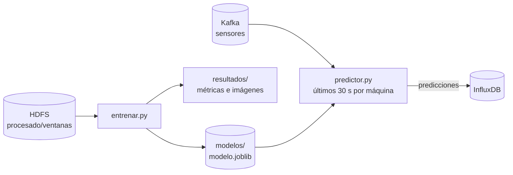
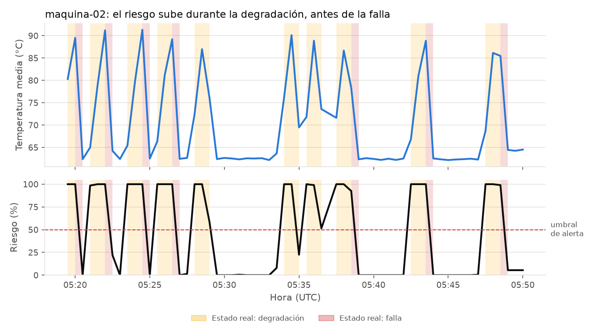
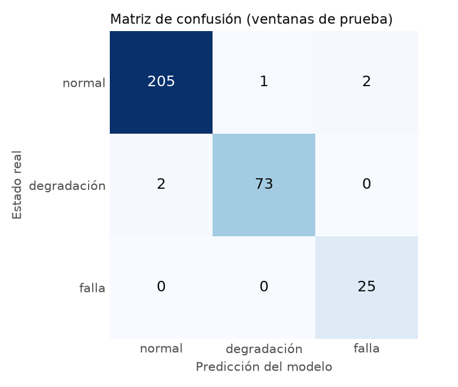
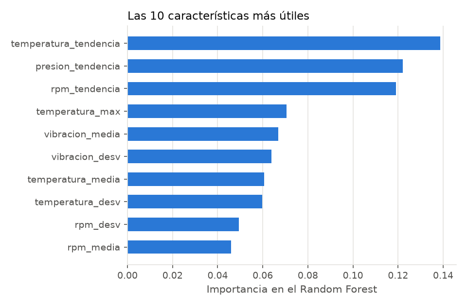

# Modelo predictivo (Scikit-learn)

Dos piezas:

- **`entrenar.py`**: entrena los modelos con el histórico procesado por Spark (PR 5) y genera métricas e imágenes.
- **`predictor.py`**: servicio en vivo. Aplica los modelos a las lecturas que llegan por Kafka y escribe el **riesgo de falla** y las **alertas** en InfluxDB, para Grafana (PR 7).



## Dos modelos, dos enfoques

| | Clasificador (Random Forest) | Detector de anomalías (Isolation Forest) |
|---|---|---|
| Tipo | **Supervisado**: aprende de ejemplos etiquetados | **No supervisado**: no necesita etiquetas |
| Qué aprende | A distinguir *normal*, *degradación* y *falla* | Cómo es una máquina **normal** |
| Qué responde | Probabilidad de cada estado → **riesgo** = P(degradación) + P(falla) | ¿Esta ventana se parece a lo normal? |
| Ventaja | Muy preciso y dice *qué* está pasando | En una fábrica real casi nunca hay fallas etiquetadas; este modelo igual funciona |

**¿Por qué detectar la degradación es predecir la falla?** En la simulación, cada falla viene precedida por ~60 s de degradación. Por eso, si el modelo reconoce la degradación, avisa **antes** de que la máquina falle.

## Datos de entrenamiento

Cada fila es una **ventana de 30 s de una máquina** con las 20 características que calcula Spark: media, desviación, mínimo, máximo y tendencia de los 4 sensores. La etiqueta es el estado mayoritario de la ventana.

- La división es **por tiempo**: el primer 75 % se usa para entrenar y el último 25 % para evaluar, como pasaría en la fábrica. Mezclar al azar haría trampa, porque ventanas vecinas son casi iguales.
- `class_weight="balanced"`: hay muchas más ventanas normales que de falla, y así el modelo no las ignora.

### Generar historia para entrenar

A velocidad real harían falta horas de datos. `sensores/generar_historico.py` genera **2 horas de lecturas pasadas en segundos** y las manda por MQTT, así que recorren el pipeline completo igual que las reales:

```bash
docker compose run --rm sensores python generar_historico.py --horas 2 --semilla 42
```

## Resultados

Con 2 horas de historia generadas con `--semilla 42` desde volúmenes vacíos (1228 ventanas; 920 para entrenar y 308 para evaluar). Siguiendo los pasos de [Cómo ejecutarlo](#cómo-ejecutarlo) se obtienen números muy parecidos. No son idénticos porque las lecturas en vivo que se mezclan con la historia no usan la semilla.

| Clasificador | Precisión | Recall | Ventanas de prueba |
|---|---|---|---|
| normal | 99.0 % | 98.6 % | 208 |
| degradación | 98.6 % | 97.3 % | 75 |
| falla | 92.6 % | 100 % | 25 |
| **Exactitud total** | | **98.4 %** | 308 |

- **Precisión**: de las veces que dijo "falla", cuántas eran falla.
- **Recall**: de las fallas reales, cuántas detectó.

**Alertas** (riesgo ≥ 50 %):
- Detectan el **98 %** de las ventanas con problema, con falsas alarmas en el **1.9 %** de las normales.
- **Las 25 fallas de la prueba se avisaron antes de empezar**, con **56 s de anticipación promedio**: 22 fallas con 60 s y 3 con 30 s.

¿Cómo se mide la anticipación? Por cada falla, se cuenta el tiempo entre la **primera alerta del tramo de degradación inmediatamente anterior** y el inicio de la falla.
- Como se mide por ventanas, el resultado es **múltiplo de 30 s**: "56 s" quiere decir "unas 2 ventanas antes", no una precisión al segundo.
- Una alerta que llega recién en la ventana en que empieza la falla cuenta como **0 s**, es decir, **no** como aviso anticipado.
- Si una máquina falla dos veces seguidas, la alerta de la primera falla no se atribuye a la segunda.

**Detector de anomalías**: marca como anomalía el **3.8 %** de las ventanas normales, el **63 %** de las de degradación y el **100 %** de las de falla. Sin haber visto nunca una falla, las reconoce todas. La degradación temprana le cuesta más, porque al principio se parece mucho a lo normal.

**En vivo** (10 minutos, 625 predicciones): el estado predicho coincidió con el real en el **98.6 %**. Hubo alerta en el 97 % de las degradaciones y en el 100 % de las fallas, y solo en el 0.6 % de los momentos normales.



| Matriz de confusión | Características más útiles |
|---|---|
|  |  |

Las **tendencias** son las características más importantes: el modelo aprendió a mirar **cómo están cambiando** los sensores, no solo cuánto valen. Eso le permite avisar antes de que los valores sean extremos.

Todas las métricas están en `resultados/metricas.json`.

> Los números son de una simulación: los patrones de falla son más limpios que en una máquina real. Lo que sí se traslada a la realidad es el método completo: datos → características → modelo → alerta en vivo.

## Predicción en vivo

`predictor.py`:
1. Lee las lecturas de Kafka a medida que llegan y guarda **los últimos 30 s de cada máquina**.
2. Cada **5 s** calcula las mismas 20 características que Spark, con `caracteristicas.py`. Lo verificamos recalculando **las 1230 ventanas** de Spark desde las lecturas limpias: coinciden todos los conteos y la diferencia absoluta máxima es **1e-7**, que es ruido de coma flotante.
3. Aplica los dos modelos y escribe en InfluxDB, measurement **`predicciones`**:

| Campo | Qué es |
|---|---|
| `riesgo` | P(degradación) + P(falla), de 0 a 1 |
| `alerta` | `true` si riesgo ≥ 0.5 |
| `estado_predicho` | Estado más probable según el clasificador |
| `prob_normal`, `prob_degradacion`, `prob_falla` | Probabilidad de cada estado |
| `es_anomalia`, `anomalia_score` | Resultado del detector de anomalías (score más alto = más raro) |
| `estado_real` | Estado mayoritario de la ventana, para comparar (solo existe en la simulación) |

Si no existe el modelo, el predictor **espera** a que se entrene, así que se puede levantar todo antes de entrenar. Igual que los consumidores, descarta los mensajes inválidos y solo reintenta ante fallos de red o de InfluxDB.

## Cómo ejecutarlo

```bash
# 1. Sistema completo (el predictor queda esperando el modelo)
docker compose up -d --build

# 2. Generar 2 horas de historia y esperar ~1 min a que llegue a HDFS
docker compose run --rm sensores python generar_historico.py --horas 2 --semilla 42

# 3. Procesar con Spark
docker compose run --rm spark

# 4. Entrenar: crea ml/modelos/modelo.joblib y ml/resultados/
docker compose run --rm entrenar

# 5. Ver las alertas en vivo
docker compose logs -f predictor
```

Para ver las predicciones en InfluxDB (http://localhost:8086 → Data Explorer → bucket `sensores` → measurement `predicciones`), o desde la terminal:

```bash
docker compose exec influxdb influx query --org grupo5 --token token-demo-grupo5 \
  'from(bucket:"sensores") |> range(start:-5m) |> filter(fn:(r) => r._measurement == "predicciones" and r._field == "riesgo") |> last()'
```

Para reentrenar con más datos se repiten los pasos 3 y 4, y después `docker compose restart predictor`.

> **Ojo al reentrenar:** `entrenar` sobrescribe `ml/resultados/` (`metricas.json` y las 3 imágenes), que están en el repositorio como resultado de referencia. Si no se quiere guardar la nueva corrida, se descarta con `git checkout -- ml/resultados/`.

### Correrlo local con uv

Requiere Python ≥ 3.11, que `uv` instala si hace falta. Así hay una sola versión de scikit-learn y el modelo entrenado en Docker se puede cargar en local y al revés. Para leer HDFS hace falta la entrada `127.0.0.1 datanode` en `/etc/hosts` (ver el README del PR 4).

```bash
cd ml
uv run entrenar.py
uv run predictor.py
```
