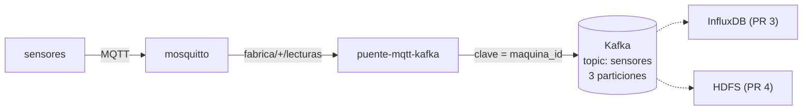

# Puente MQTT → Kafka

`puente.py` se suscribe a las lecturas de todas las máquinas en MQTT (`fabrica/+/lecturas`) y reenvía cada mensaje al topic **`sensores`** de Kafka.



## ¿Por qué Kafka si ya tenemos MQTT?

Cada uno resuelve una parte distinta del problema:

| | MQTT (Mosquitto) | Kafka |
|---|---|---|
| Pensado para | Dispositivos IoT con poca red y batería | Mover grandes volúmenes de datos dentro de la plataforma |
| ¿Guarda los mensajes? | No: si nadie está escuchando, el mensaje se pierde | Sí, en disco. Los guardamos **7 días** |
| Varios lectores | Todos reciben lo mismo en el momento | Cada consumidor lee a su ritmo y puede **releer** desde el inicio |
| Escala | Un broker | Particiones repartidas en varios servidores |

MQTT es la puerta de entrada desde las máquinas. Kafka es la "columna vertebral" de la que leen InfluxDB, HDFS y el modelo. Si uno de ellos se cae, al volver sigue leyendo desde donde quedó, sin perder datos.

## Conceptos de Kafka que usamos

- **Topic `sensores`**: la "carpeta" donde se guardan todas las lecturas. Lo crea el servicio `kafka-init` al arrancar.
- **3 particiones**: el topic se divide en 3 partes para poder leerlas en paralelo.
- **Clave = `maquina_id`**: todas las lecturas de una misma máquina van a la misma partición, así Kafka **mantiene su orden**.
- **`acks=all` + idempotencia**: el puente espera a que Kafka confirme cada mensaje y, si reintenta, no genera duplicados.
- **KRaft**: Kafka corre sin Zookeeper, en un solo nodo que hace de broker y de controller.

## Configuración

| Variable | Por defecto | Qué hace |
|---|---|---|
| `MQTT_HOST` / `MQTT_PORT` | `localhost` / `1883` | Broker MQTT |
| `MQTT_TOPIC` | `fabrica/+/lecturas` | Topics a escuchar (`+` = cualquier máquina) |
| `KAFKA_BOOTSTRAP` | `localhost:9094` | Dirección de Kafka |
| `KAFKA_TOPIC` | `sensores` | Topic de destino |

Kafka escucha en dos puertos:

- `kafka:9092`: para los contenedores dentro de Docker.
- `localhost:9094`: para scripts que corren en tu máquina con `uv`.

## Cómo probarlo

```bash
docker compose up -d --build

# Ver las lecturas llegando a Kafka (con su clave y partición)
docker compose exec kafka /opt/kafka/bin/kafka-console-consumer.sh \
  --bootstrap-server kafka:9092 --topic sensores \
  --formatter-property print.key=true --formatter-property print.partition=true

# Ver el topic y sus particiones
docker compose exec kafka /opt/kafka/bin/kafka-topics.sh \
  --bootstrap-server kafka:9092 --describe --topic sensores

# Cuántos mensajes hay en cada partición
docker compose exec kafka /opt/kafka/bin/kafka-get-offsets.sh \
  --bootstrap-server kafka:9092 --topic sensores

# Logs del puente (cada 500 mensajes informa cuántos lleva)
docker compose logs -f puente-mqtt-kafka
```

Al arrancar, el puente puede mostrar `Coordinator load in progress: retrying` unos segundos mientras Kafka termina de iniciar. Es normal y se resuelve solo.

### Correrlo local con uv

```bash
docker compose up -d mosquitto kafka kafka-init sensores
cd puente-mqtt-kafka
uv run puente.py
```

Con `Ctrl+C` se detiene de forma ordenada: primero envía a Kafka los mensajes pendientes.

## Qué pasa si algo falla

- **Mensaje que no es JSON o no trae `maquina_id`**: se descarta y queda registrado en el log.
- **Kafka se cae**: el puente guarda los mensajes en memoria y los envía cuando Kafka vuelve. Lo probamos reiniciando Kafka con el sistema corriendo: no se perdió ninguna lectura, no hubo duplicados y el orden se mantuvo.
- **MQTT se cae**: el puente se reconecta y se vuelve a suscribir solo. A diferencia de Kafka, aquí sí se puede perder la lectura que iba en vuelo, porque el broker no guarda la sesión (`persistence false`). En las pruebas fue 1 lectura de 814.
- **`docker compose down`**: los mensajes de Kafka se guardan en el volumen `kafka-data`, así que no se pierden. Para borrarlos: `docker compose down -v`.
