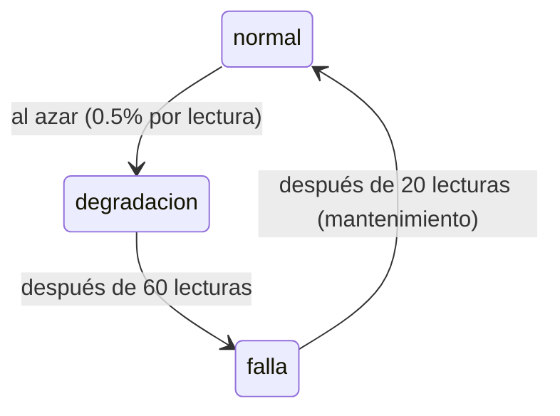

# Sensores IoT (simulados)

Como no tenemos máquinas reales, `simulador.py` imita varias máquinas de la fábrica. Cada una publica **una lectura por segundo** al broker MQTT.

## Qué mide cada máquina

| Campo | Unidad | Valor normal aprox. | Cuando falla |
|---|---|---|---|
| `temperatura` | °C | 55 – 65 | sube ~30 °C |
| `vibracion` | mm/s | 1.5 – 2.5 | sube a ~8 |
| `presion` | bar | 4.5 – 5.5 | baja ~1.5 bar |
| `rpm` | rev/min | 1450 – 1550 | baja ~200 rpm |

## Cómo se simulan las fallas

Cada máquina pasa por tres estados:



- **normal**: valores estables con un poco de ruido.
- **degradacion**: los valores empeoran poco a poco. Es la etapa que el modelo del PR 6 debe detectar **antes** de la falla.
- **falla**: valores fuera de rango.

El campo `estado` es la "respuesta correcta" de cada lectura. Una máquina real no lo enviaría, pero en la simulación sirve para entrenar y evaluar el modelo.

## Mensaje publicado

Topic: `fabrica/<maquina_id>/lecturas`

```json
{
  "maquina_id": "maquina-03",
  "timestamp": "2026-09-30T23:13:56.874Z",
  "temperatura": 63.1,
  "vibracion": 2.318,
  "presion": 4.901,
  "rpm": 1432.3,
  "estado": "degradacion"
}
```

## Configuración

Se cambia con variables de entorno en `docker-compose.yml`:

| Variable | Por defecto | Qué hace |
|---|---|---|
| `MQTT_HOST` | `localhost` | Dirección del broker |
| `MQTT_PORT` | `1883` | Puerto del broker |
| `NUM_MAQUINAS` | `5` | Cuántas máquinas simular |
| `INTERVALO_SEGUNDOS` | `1` | Cada cuánto publica cada máquina |
| `PROB_DEGRADACION` | `0.005` | Probabilidad de que una máquina sana empiece a fallar en cada lectura |

## Cómo probarlo

```bash
docker compose up -d --build mosquitto sensores

# Ver los mensajes que llegan al broker
docker compose exec mosquitto mosquitto_sub -t 'fabrica/#' -v

# Ver los cambios de estado de las máquinas
docker compose logs -f sensores
```

Para ver fallas más seguido: `PROB_DEGRADACION: 0.05` en `docker-compose.yml`.

### Correrlo local con uv

Las dependencias se manejan con [uv](https://docs.astral.sh/uv/). `pyproject.toml` declara lo que necesitamos y `uv.lock` fija las versiones exactas, así todo el grupo usa lo mismo. El Dockerfile instala desde el mismo `uv.lock`.

```bash
docker compose up -d mosquitto   # solo el broker
cd sensores
uv run simulador.py              # crea el .venv, instala y ejecuta
```

Para agregar una dependencia: `uv add <paquete>` (actualiza `pyproject.toml` y `uv.lock`).

## Generar historia para entrenar el modelo

`generar_historico.py` simula las mismas máquinas, pero con lecturas de las **últimas N horas** (una por segundo), y las publica lo más rápido posible. Pasan por todo el pipeline igual que las lecturas en vivo, así no hay que esperar horas para tener datos de entrenamiento (PR 6):

```bash
docker compose run --rm sensores python generar_historico.py --horas 2 --semilla 42
```

Con `--semilla` se genera siempre la misma historia. 2 horas son 36 000 lecturas y se publican en unos segundos.

## Opcional: Node-RED

`node-red/flujo-sensores.json` hace lo mismo pero de forma visual. Simula una máquina llamada `maquina-nodered`.

1. `docker compose --profile nodered up -d`
2. Abrir http://localhost:1880
3. Menú (☰) → **Import** → seleccionar `node-red/flujo-sensores.json` → **Import** → **Deploy**

El flujo es: **Cada 1 segundo** → **Generar lectura** → **Publicar en MQTT**.
