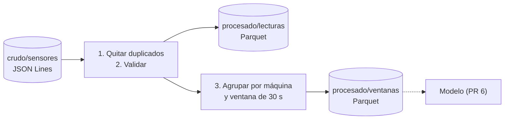

# Procesamiento con Spark

`procesar.py` es un job de **PySpark** que lee el histórico crudo del Data Lake (PR 4), lo limpia y calcula **características por ventana de tiempo**. Esas características son la entrada del modelo de predicción de fallas (PR 6).



## ¿Por qué Spark?

Spark reparte el trabajo en muchas tareas que corren **en paralelo**. Aquí corre en un solo contenedor (`--master=local[*]`, usando todos sus núcleos). El mismo código procesaría terabytes en un clúster de cientos de máquinas cambiando solo `--master`. Es la herramienta estándar para procesar Data Lakes.

## Qué hace, paso a paso

### 1. Quitar duplicados
Si el consumidor de HDFS reescribió un lote, hay lecturas repetidas. El par **(`_kafka_particion`, `_kafka_offset`)** identifica cada lectura de forma única, así que se deja una sola.

### 2. Validar (zona cruda → zona procesada)
Se descarta una lectura si:
- falta un campo o un valor no es numérico (por ejemplo `"temperatura": "caliente"`),
- la fecha no es válida,
- el `estado` no es `normal`, `degradacion` ni `falla`,
- un valor está fuera de lo físicamente posible:

| Sensor | Rango válido |
|---|---|
| temperatura | −40 a 200 °C |
| vibracion | 0 a 100 mm/s |
| presion | 0 a 20 bar |
| rpm | 0 a 5000 |

Las lecturas limpias se guardan en **`/datalake/procesado/lecturas`**.

### 3. Características por ventana
Las lecturas de cada máquina se agrupan en **ventanas de 30 segundos** (~30 lecturas). Por cada sensor se calcula:

| Característica | Qué indica |
|---|---|
| `_media` | Nivel promedio |
| `_desv` | Cuánto varía (una máquina que falla vibra de forma más irregular) |
| `_min` / `_max` | Extremos |
| `_tendencia` | Cuánto sube o baja **por segundo**: es la pendiente de la recta que mejor ajusta las lecturas. Avisa *antes* de que el valor sea alto |

Además se agregan las etiquetas que vienen de la simulación, para entrenar y evaluar el modelo: `estado_mayoritario`, `lecturas_degradacion` y `lecturas_falla`.

Se guardan en **`/datalake/procesado/ventanas`**.

### ¿Por qué Parquet?
Es un formato **por columnas y comprimido**. Si el modelo solo necesita `vibracion_media`, Parquet lee solo esa columna. Ocupa mucho menos que JSON y guarda los tipos de datos.

## Resultado de ejemplo

```
Lecturas en el Data Lake: 2820
  duplicadas eliminadas:  1410
  inválidas descartadas:  5
  lecturas limpias:       1405
Guardado hdfs://namenode:8020/datalake/procesado/lecturas
Guardado hdfs://namenode:8020/datalake/procesado/ventanas (50 ventanas de 30 seconds)

Promedio de las características según el estado de la máquina:
+------------------+--------+-----------------+---------------+-------------+---------+--------------+--------------------+
|estado_mayoritario|ventanas|temperatura_media|vibracion_media|presion_media|rpm_media|vibracion_desv|temp_tendencia_por_s|
+------------------+--------+-----------------+---------------+-------------+---------+--------------+--------------------+
|normal            |22      |62.03            |2.38           |4.81         |1481.82  |0.395         |-0.104              |
|degradacion       |22      |75.23            |4.4            |4.2          |1376.95  |0.961         |0.402               |
|falla             |6       |83.5             |6.77           |3.83         |1334.11  |1.866         |-0.689              |
+------------------+--------+-----------------+---------------+-------------+---------+--------------+--------------------+
```

La tabla muestra que **las características separan bien los estados**, y por eso el modelo del PR 6 va a poder aprender de ellas:

- En **degradación**, la temperatura sube **~0.4 °C por segundo**, antes de llegar a valores de falla. Es la señal temprana que buscamos.
- En **falla**, la vibración media casi se triplica (2.4 → 6.8 mm/s) y varía cinco veces más (desviación 0.4 → 1.9).
- En **falla** la tendencia de temperatura sale negativa porque esas ventanas suelen incluir la reparación, cuando la máquina vuelve a valores normales.

## Cómo ejecutarlo

Spark no queda corriendo: se ejecuta cuando se quiere procesar el Data Lake. Hace falta que HDFS tenga datos, así que conviene dejar el sistema corriendo unos minutos antes.

```bash
docker compose up -d --build        # sistema completo, juntando datos
docker compose run --rm spark       # procesa todo el Data Lake (~20 s)
```

Para ver la web de Spark mientras corre (tareas, etapas y tiempos), agregar `--service-ports` y abrir http://localhost:4040:

```bash
docker compose run --rm --service-ports spark
```

Cada ejecución **recalcula todo** desde el crudo y reemplaza las tablas procesadas, así que se puede correr las veces que se quiera.

### Ver el resultado

```bash
docker compose exec namenode hdfs dfs -ls -R /datalake/procesado
```

O en http://localhost:9870 → **Utilities → Browse the file system** → `/datalake/procesado`.

### Configuración

| Variable | Por defecto | Qué hace |
|---|---|---|
| `HDFS_URL` | `hdfs://namenode:8020` | Dirección del namenode |
| `VENTANA` | `30 seconds` | Tamaño de cada ventana (por ejemplo `1 minute`) |

### Correrlo local con uv

Requiere **Java 17 o 21** instalado (`java -version`). Igual que el consumidor de HDFS, necesita la entrada `127.0.0.1 datanode` en `/etc/hosts`, porque Spark lee los bloques directamente del datanode.

```bash
docker compose up -d namenode datanode
cd spark
HDFS_URL=hdfs://localhost:8020 uv run procesar.py
```

> `uv` descarga PySpark (~400 MB) la primera vez.
